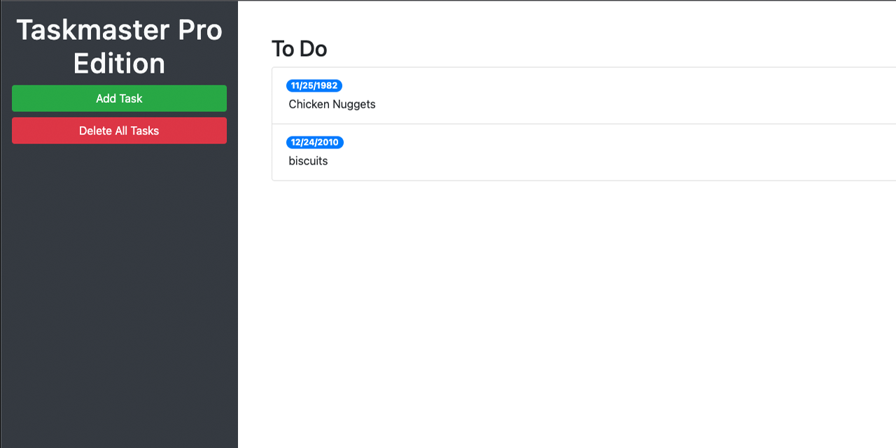

# Taskmaster-Pro

Deployed at https://cbarber1984.github.io/taskmaster-pro/ 

## What I learned
- Learn to consult documentation when faced with new libraries.
- Traverse and manipulate the DOM using jQuery methods.
- Attach delegated browser events to elements with jQuery methods.
- Implement a better user experience with focus and blur events.
- Practice other applications of this to distinguish between clicked elements.
- Create responsive layouts using Bootstrap's grid system.
- Use the UI components Bootstrap provides us.
- Leverage Bootstrap's utility classes to avoid creating unnecessary custom CSS.
- Incorporate additional CDN links into a project.
- Skim new documentation to quickly learn about new tools.
- Use jQuery extensions to enable draggable elements.
- Learn how to use jQuery UI's Datepicker widget with date-input form fields.
- Implement another third-party JavaScript library using a CDN link.
- Learn how JavaScript natively handles date and time functionality.
Use Moment.js to make handling JavaScript date and time functionality a lot easier.
- Use JavaScript timer functions to schedule/automate logic.
- Use a font library to implement custom fonts.
- Use an icon library to implement font icons.
Override default Bootstrap styles using custom CSS.